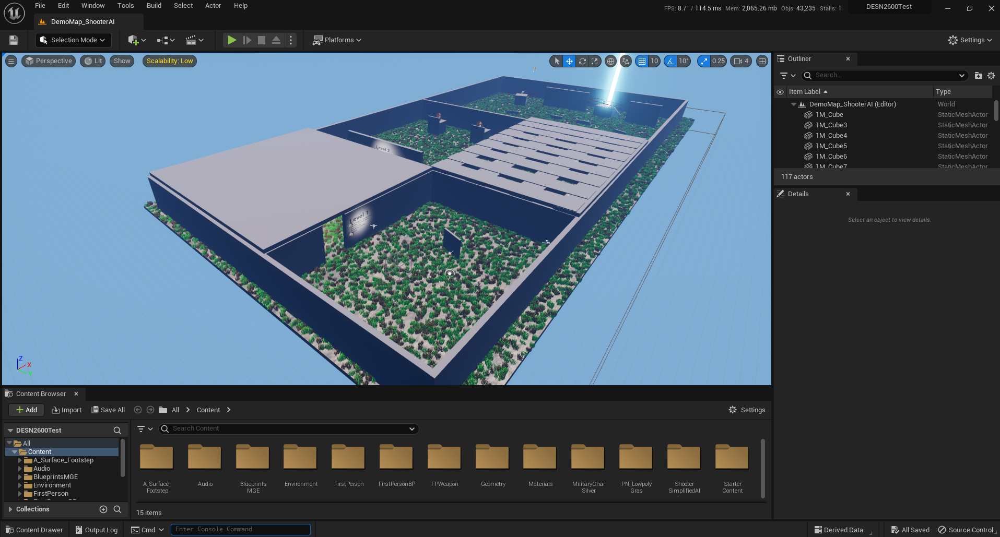
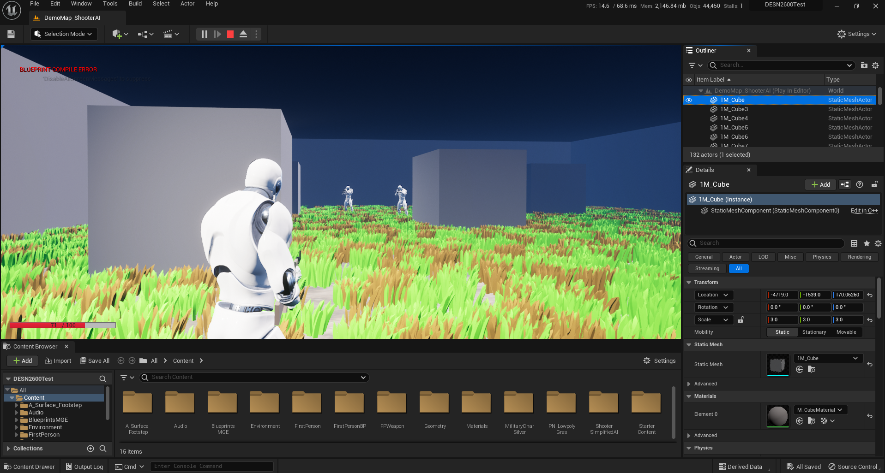
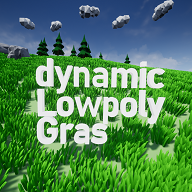
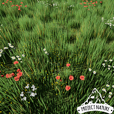
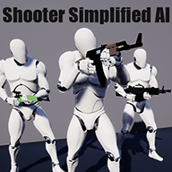
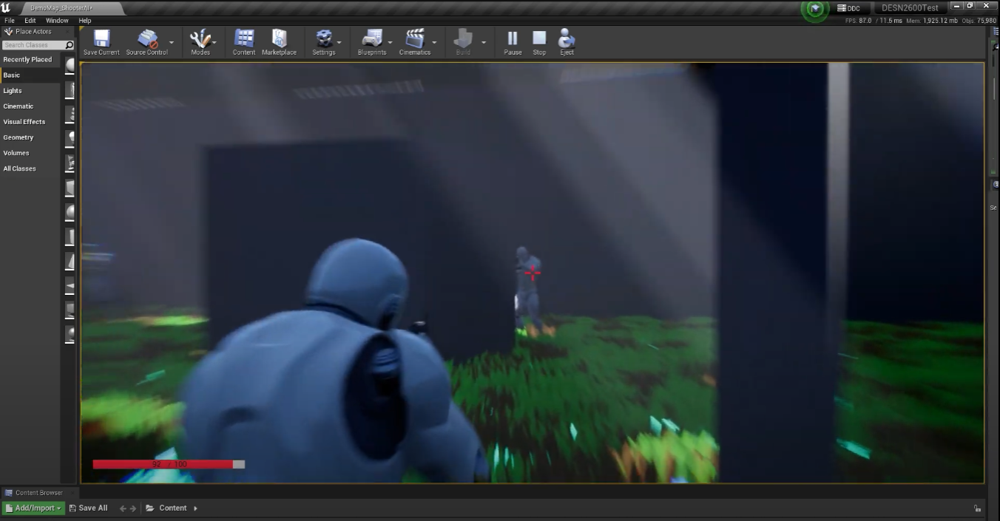

# Quantum Breach: A Sci-Fi FPS Adventure
### Developed with Unreal Engine 5

# Game Screenshots

*Caption: Intense firefight in a futuristic cityscape*

*Caption: Player wielding advanced quantum weaponry*

*Caption: Our innovative dynamic low-poly grass system*

*Caption: Lush open-world environments with advanced foliage rendering*

*Caption: Simplified diagram of our advanced AI behavior systems*

*Caption: Tactical combat scenario showcasing environmental interactions*

*Caption: Optional third-person perspective for cinematic moments*

# Getting Started

After downloading, extract the archive and run the executable. You may need to allow the app to run through your system's security settings.
